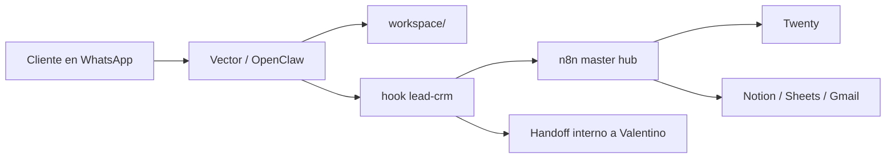

# Vector for GalfreDev

Bot comercial de WhatsApp para GalfreDev, construido sobre OpenClaw.

Este repositorio guarda la parte versionable del proyecto:

- identidad, prompts y memoria del agente
- hook interno de leads y handoff
- workflows canonicos de `n8n`
- scripts operativos y de validacion
- configuraciones de ejemplo y documentacion de deploy

No incluye el runtime vivo:

- sesiones de WhatsApp
- credenciales OAuth o API keys reales
- runtime state de OpenClaw
- logs, media ni leads reales

## Estado actual

Perfil productivo recomendado y validado:

- modelo principal: `google/gemini-2.5-flash`
- fallback: `openai/gpt-5.4-mini`
- canal principal: WhatsApp
- gateway: OpenClaw sobre `systemd`
- intake y CRM: `n8n` + `Twenty`

El repo ya esta orientado a usar API keys de proveedor para produccion y evitar depender de OAuth personal.

## Que hace el bot

Vector atiende leads comerciales por WhatsApp.

Flujo principal:

1. recibe un lead
2. responde en tono profesional y breve
3. detecta si el caso encaja con automatizacion, software, IA o integraciones
4. pide el minimo contexto util
5. resume la necesidad
6. deriva a Valentino
7. registra el lead y dispara el webhook a `n8n`

Capacidades relevantes:

- entiende texto, audios, imagenes y documentos como contexto comercial
- reenvia adjuntos utiles al handoff interno
- genera payload normalizado para CRM Hub
- opera un canal interno de owner por WhatsApp
- soporta mejora continua supervisada

## Arquitectura



Mas detalle:

- [ARCHITECTURE.md](./docs/ARCHITECTURE.md)
- [OPERATIONS.md](./docs/OPERATIONS.md)

## Estructura

- [workspace/](./workspace/): identidad, prompts y reglas del agente
- [hooks/lead-crm/](./hooks/lead-crm/): hook de intake, payload y handoff
- [workflows/n8n/](./workflows/n8n/): workflows canonicos soportados
- [scripts/](./scripts/): validaciones y utilidades operativas
- [config/](./config/): configuraciones de ejemplo
- [deploy/](./deploy/): templates de servicio y timers
- [docs/](./docs/): runbooks, setup y estrategia

## Config recomendada

Base recomendada para produccion nueva:

- [config/openclaw.gemini-fallback.example.json](./config/openclaw.gemini-fallback.example.json)

Base minimal alternativa:

- [config/openclaw.example.json](./config/openclaw.example.json)

Variables relevantes:

- `GEMINI_API_KEY`
- `OPENAI_API_KEY`
- `LEAD_DESTINATION`
- `N8N_WEBHOOK_URL`
- `CRM_FANOUT_WEBHOOK_URLS`
- `TWENTY_BASE_URL`
- `TWENTY_API_KEY`
- `gateway.auth.token`

Ejemplo de entorno:

- [.env.example](./.env.example)

## Setup rapido

1. Instalar OpenClaw en el VPS.
2. Copiar `workspace/` a `~/.openclaw/workspace/`.
3. Copiar `hooks/lead-crm/` a `~/.openclaw/hooks/lead-crm/`.
4. Crear `~/.openclaw/openclaw.json` desde una config de ejemplo.
5. Cargar API keys y variables reales.
6. Importar el workflow canonico de `n8n`.
7. Vincular WhatsApp.
8. Levantar `openclaw-galfre.service`.

Guias:

- [QUICKSTART.md](./docs/QUICKSTART.md)
- [DEPLOY.md](./docs/DEPLOY.md)
- [TESTING.md](./docs/TESTING.md)

## Validacion local

```bash
npm install
npm run check
npm run check:bot
npm run validate:crm-payload -- ./docs/examples/sample-lead-payload.json
```

Que valida cada comando:

- `npm run check`: TypeScript y workflows canonicos
- `npm run check:bot`: coherencia del runtime local de OpenClaw
- `npm run validate:crm-payload`: payload ejemplo de lead

## Operacion en produccion

Puntos operativos importantes:

- usar API keys de proveedor en vez de OAuth humano
- dejar `google/gemini-2.5-flash` como primary y `openai/gpt-5.4-mini` como fallback
- monitorear `openclaw models status`, `openclaw channels status` y el webhook de `n8n`
- probar audio, imagen y lead completo despues de cada cambio relevante

Runbooks utiles:

- [OPENCLAW-AUTH-RUNBOOK.md](./docs/OPENCLAW-AUTH-RUNBOOK.md)
- [STEP-BY-STEP-GEMINI-CUTOVER.md](./docs/STEP-BY-STEP-GEMINI-CUTOVER.md)
- [GEMINI-FLASH-2.5-INTEGRATION-PLAN.md](./docs/GEMINI-FLASH-2.5-INTEGRATION-PLAN.md)
- [LLM-STRATEGY.md](./docs/LLM-STRATEGY.md)

## Seguridad

Antes de subir cambios:

- no commitear `.openclaw/`
- no commitear `credentials/`, `auth-profiles.json` ni `models.json`
- no commitear logs, media ni leads reales
- no commitear `.env` reales ni tokens

Referencias:

- [.gitignore](./.gitignore)
- [PUBLISHING.md](./docs/PUBLISHING.md)

## Documentacion clave

- [BOT-SUMMARY.md](./docs/BOT-SUMMARY.md)
- [OPERATIONS.md](./docs/OPERATIONS.md)
- [TWENTY-CRM-HUB.md](./docs/TWENTY-CRM-HUB.md)
- [MASTER-FLOW.md](./docs/MASTER-FLOW.md)
- [LIVE-SETUP-CHECKLIST.md](./docs/LIVE-SETUP-CHECKLIST.md)
- [ENGINEER-HANDOFF.md](./docs/ENGINEER-HANDOFF.md)

## Licencia

MIT. Ver [LICENSE](./LICENSE).
