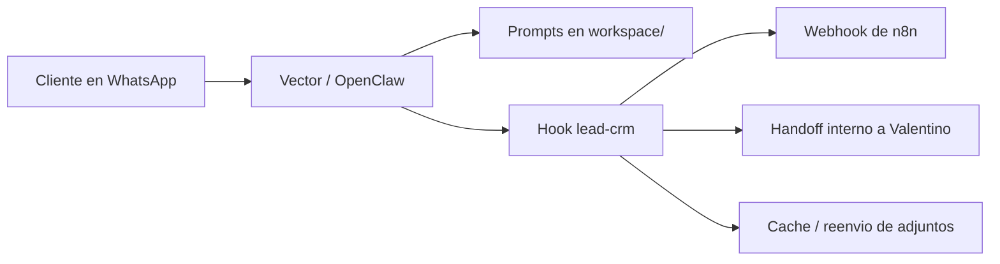

# Vector for GalfreDev

Bot comercial de WhatsApp para GalfreDev, construido sobre OpenClaw.

Este repositorio contiene la parte versionable del proyecto:

- identidad y prompts del agente
- hook interno para CRM y reenvio de adjuntos relevantes
- workflow de `n8n` para intake de leads
- ejemplos de configuracion y despliegue
- scripts de soporte

No contiene el estado vivo del bot:

- sesiones de WhatsApp
- credenciales OAuth
- tokens o secretos
- runtime state de OpenClaw
- logs, media y leads reales de produccion

## Que hace este bot

Vector es el asistente comercial de GalfreDev en WhatsApp.

Su objetivo es:

- responder de forma natural y profesional
- entender rapidamente la necesidad del lead
- detectar si el caso encaja con lo que vende GalfreDev
- pedir el minimo contexto necesario
- derivar a Valentino con un resumen claro
- registrar el lead y notificarlo via `n8n`

Tambien esta preparado para:

- transcribir audios con `whisper.cpp` via CLI local
- entender imagenes y documentos relevantes
- reenviar adjuntos utiles al handoff interno
- mejorar de forma supervisada con propuestas por WhatsApp
- operar un canal interno con Valentino para brief, estado y audio
- cerrar la conversacion del cliente sin dejarla abrupta

## Stack

- OpenClaw
- WhatsApp
- OpenAI `gpt-5.4`
- `n8n`
- TypeScript
- PowerShell
- Linux `systemd` para produccion

## Arquitectura



Mas detalle en [docs/ARCHITECTURE.md](./docs/ARCHITECTURE.md).

## Estructura del repo

- [workspace/](./workspace/): identidad, prompts, memoria y reglas del agente
- [hooks/lead-crm/](./hooks/lead-crm/): hook que registra leads y reenvia adjuntos
- [scripts/](./scripts/): utilidades de soporte, como export de leads
- [workflows/n8n/](./workflows/n8n/): workflow de intake para `n8n`
- [config/](./config/): configuracion de ejemplo de OpenClaw
- [deploy/](./deploy/): templates de despliegue
- [docs/](./docs/): documentacion operativa y de publicacion

## Archivos clave

- [workspace/AGENTS.md](./workspace/AGENTS.md)
- [workspace/MEMORY.md](./workspace/MEMORY.md)
- [hooks/lead-crm/handler.ts](./hooks/lead-crm/handler.ts)
- [config/openclaw.example.json](./config/openclaw.example.json)
- [workflows/n8n/galfredev-leads.workflow.json](./workflows/n8n/galfredev-leads.workflow.json)
- [docs/OPERATIONS.md](./docs/OPERATIONS.md)
- [docs/BOT-SUMMARY.md](./docs/BOT-SUMMARY.md)

## Instalacion rapida

Resumen corto:

1. Instalar OpenClaw en el servidor.
2. Copiar `workspace/` a `~/.openclaw/workspace/`.
3. Copiar `hooks/lead-crm/` a `~/.openclaw/hooks/lead-crm/`.
4. Crear `~/.openclaw/openclaw.json` a partir de `config/openclaw.example.json`.
5. Configurar destino de leads, webhook de `n8n` y token del gateway.
6. Importar el workflow de `n8n`.
7. Relinkear WhatsApp.
8. Levantar OpenClaw como servicio.

Guia paso a paso:

- [docs/QUICKSTART.md](./docs/QUICKSTART.md)
- [docs/DEPLOY.md](./docs/DEPLOY.md)

## Flujo comercial

El flujo esperado del bot es:

1. Saludo inicial como asistente de GalfreDev.
2. Calificacion rapida del lead.
3. Una o pocas preguntas utiles si falta contexto.
4. Resumen corto de la necesidad.
5. Handoff a Valentino.
6. Nota interna del lead.
7. Registro del lead en CRM.

## Seguridad

Este repo esta preparado para publicarse sin exponer secretos, pero igual conviene revisar siempre:

- no subir `openclaw.json` real
- no subir `credentials/`
- no subir `auth-profiles.json`
- no subir leads reales ni media real
- no subir `.openclaw/` ni `.codex-stage/`

Ver tambien:

- [docs/PUBLISHING.md](./docs/PUBLISHING.md)
- [.gitignore](./.gitignore)

## Estado de produccion

La version productiva actual corre en un VPS Linux con:

- OpenClaw como servicio `systemd`
- WhatsApp enlazado al servidor
- `gpt-5.4` como modelo principal
- webhook hacia `n8n`

Este repositorio representa la parte limpia y mantenible del proyecto, no el runtime real.

## Scripts utiles

Export de leads desde sesiones locales:

```powershell
powershell -ExecutionPolicy Bypass -File .\scripts\export-leads.ps1
```

Wrappers de transcripcion local:

- `scripts/openclaw-whisper-stt.ps1`
- `scripts/openclaw-whisper-stt.sh`

Automatizacion de mejora continua:

- `scripts/vector-improvement-analyze.mjs`
- `scripts/vector-improvement-check-approval.mjs`
- `scripts/vector-improvement-apply.mjs`

Owner ops:

- `scripts/vector-owner-brief.mjs`
- `scripts/vector-owner-control-check.mjs`

## Publicacion en GitHub

Este repo ya fue saneado para compartirse.

Si queres replicar el flujo en otro proyecto:

1. dejar solo archivos versionables
2. agregar `openclaw.example.json`
3. excluir credenciales y runtime
4. documentar deploy y operacion

## Documentacion adicional

- [docs/ARCHITECTURE.md](./docs/ARCHITECTURE.md)
- [docs/QUICKSTART.md](./docs/QUICKSTART.md)
- [docs/DEPLOY.md](./docs/DEPLOY.md)
- [docs/ELEVENLABS-CRON-PLAN.md](./docs/ELEVENLABS-CRON-PLAN.md)
- [docs/BOT-SUMMARY.md](./docs/BOT-SUMMARY.md)
- [docs/OPERATIONS.md](./docs/OPERATIONS.md)
- [docs/TESTING.md](./docs/TESTING.md)
- [docs/PUBLISHING.md](./docs/PUBLISHING.md)
- [CONTRIBUTING.md](./CONTRIBUTING.md)

## Licencia

MIT. Ver [LICENSE](./LICENSE).

## Notas

- El contenido del `workspace/` esta en espanol porque el bot fue disenado para atencion comercial en ese idioma.
- El hook `lead-crm` asume una integracion simple con `n8n`, pero puede adaptarse a otros CRMs.
