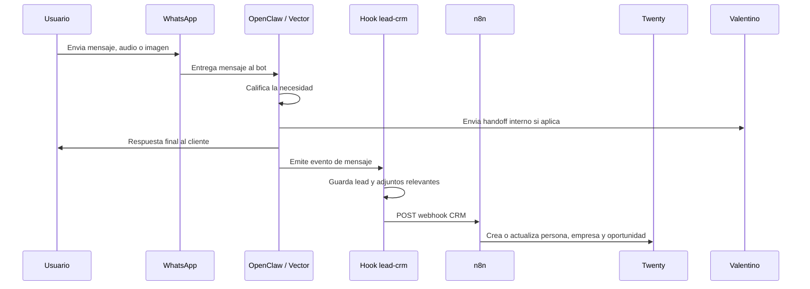

# Architecture

## Resumen

El sistema se divide en 5 piezas principales:

1. `Vector` como agente comercial
2. OpenClaw como runtime y gateway
3. WhatsApp como canal de entrada y salida
4. `n8n` como integrador y automatizador
5. `Twenty` como CRM hub y fuente de verdad comercial

## Componentes

### 1. Workspace del agente

Ubicado en [`workspace/`](../workspace/).

Contiene:

- identidad del agente
- tono y personalidad
- reglas comerciales
- reglas de calificacion
- memoria del negocio
- datos del fundador y de la marca

El archivo mas importante es [`workspace/AGENTS.md`](../workspace/AGENTS.md).

### 2. OpenClaw

OpenClaw ejecuta:

- el agente
- el canal de WhatsApp
- el gateway de control
- los hooks internos

La configuracion base se modela desde [`config/openclaw.example.json`](../config/openclaw.example.json).

### 3. Hook `lead-crm`

Ubicado en [`hooks/lead-crm/`](../hooks/lead-crm/).

Responsabilidades:

- detectar mensajes de lead interno
- guardar un registro JSONL local
- cachear imagenes y documentos relevantes
- reenviar adjuntos utiles a Valentino
- notificar a `n8n` por webhook

Archivo principal:

- [`hooks/lead-crm/handler.ts`](../hooks/lead-crm/handler.ts)

### 4. n8n

`n8n` recibe el payload del lead por webhook y lo deja listo para automatizaciones posteriores.

Con la nueva capa CRM Hub, `n8n` deja de ser solo intake y pasa a ser el orquestador entre:

- `Twenty`
- `Notion`
- `Google Sheets`
- Gmail u otros canales operativos

### 5. Twenty

`Twenty` pasa a ser la fuente de verdad estructurada del estado comercial.

Responsabilidades:

- guardar personas, empresas y oportunidades
- centralizar etapas comerciales y seguimiento
- sostener tareas y notas estructuradas
- servir como base para automatizaciones futuras

Workflow incluido:

- [`workflows/n8n/galfredev-master-hub.workflow.json`](../workflows/n8n/galfredev-master-hub.workflow.json)

## Flujo de datos

## Decisiones de diseno

### Mantener el runtime fuera del repo

El repo no contiene:

- sesiones
- credenciales
- tokens
- logs
- runtime state

Eso permite:

- publicar el proyecto con seguridad
- versionar solo la parte mantenible
- mover el bot entre servidores sin arrastrar basura local

### Handoff silencioso

El lead no necesita saber si se envio o no una nota interna.

Por eso el bot:

- deriva con un cierre visible
- pero mantiene la notificacion interna separada

### CRM hub incremental

Se mantiene compatibilidad con el enfoque inicial, pero ahora el objetivo es:

- conservar el flujo actual sin romper el bot
- enriquecer el payload del hook
- usar `n8n` como capa de integracion
- consolidar el estado comercial en `Twenty`
- derivar conocimiento a `Notion` y reporting a `Sheets`

## Extension futura

Ideas naturales para una fase siguiente:

- guardar leads en base SQL
- panel de control de oportunidades
- scoring de leads
- follow-up automatico
- multiples numeros o multiples agentes
